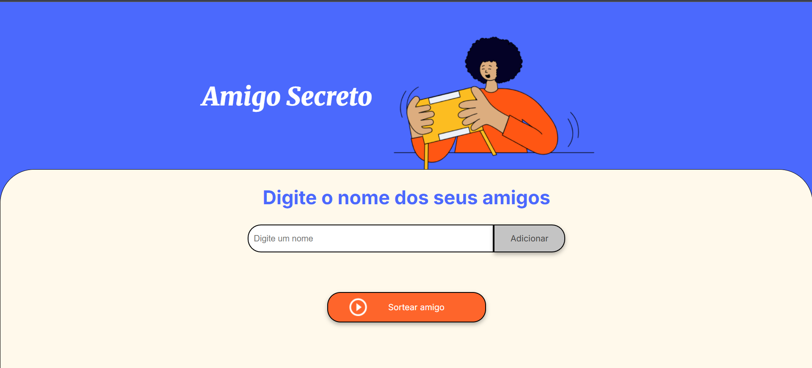
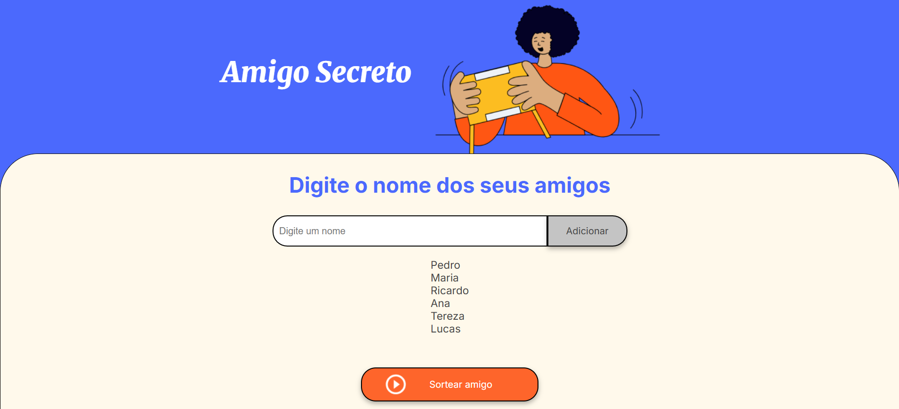
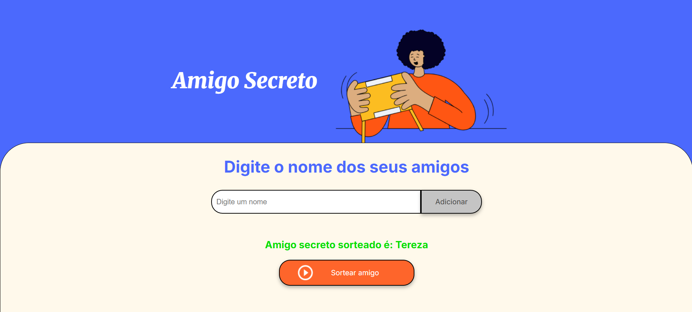

# 🎁 Amigo Secreto

Um projeto simples e interativo para sortear amigo secreto, desenvolvido com HTML, CSS e JavaScript puro.

## 📸 Preview do Projeto

<div align="center">
  
  
  
</div>

<div align="center">
  <em>Tela inicial | Lista de amigos | Resultado do sorteio</em>
</div>

## 📋 Sobre o Projeto

Este é um projeto de um sorteador de amigo secreto que permite adicionar nomes de amigos em uma lista e realizar o sorteio de forma aleatória. Foi desenvolvido como parte de um curso, Challenge sorteio do amigo secreto, programa **_Oracle Next Education (ONE) em parceria com a Alura._**

### 👨‍💻 Desenvolvimento

Minha contribuição: Responsável pela implementação completa do arquivo JavaScript (app.js), incluindo toda a lógica de funcionamento, manipulação do DOM e interatividade da aplicação.
Os arquivos HTML e CSS foram fornecidos pelo curso como base para o desenvolvimento.

## 🚀 Funcionalidades

-   ✅ Adicionar nomes à lista de amigos
-   ✅ Validação de campo vazio
-   ✅ Exibição visual da lista de amigos adicionados
-   ✅ Sorteio aleatório de um amigo da lista
-   ✅ Limpeza automática da lista após o sorteio

## 🛠️ Tecnologias Utilizadas

-   **HTML5** - Estrutura da página
-   **CSS3** - Estilização e layout responsivo
-   **JavaScript** - Lógica de funcionamento e interatividade
-   **Google Fonts** - Tipografia (Inter e Merriweather)

## 📱 Como Usar

1. Digite o nome de um amigo no campo de texto
2. Clique no botão "Adicionar" para incluir o nome na lista
3. Repita o processo para adicionar todos os amigos
4. Clique no botão "Sortear amigo" para realizar o sorteio
5. O resultado aparecerá na tela mostrando o amigo sorteado

## 📁 Estrutura do Projeto

```
projeto-amigo-secreto/
│
├── index.html          # Página principal
├── style.css           # Estilos da aplicação
├── app.js              # Lógica JavaScript
├── assets/             # Imagens do projeto
│   ├── amigo-secreto.png
│   └── play_circle_outline.png
└── README.md
```

## 🎯 Funcionalidades JavaScript Implementadas

### Principais Funções:

-   **`adicionarAmigo()`**: Adiciona um novo amigo à lista

    -   Valida se o campo não está vazio
    -   Adiciona o nome ao array `amigos`
    -   Atualiza a lista visual
    -   Limpa o campo de entrada

-   **`atualizarListaDeAmigos()`**: Atualiza a exibição visual da lista

    -   Limpa a lista anterior
    -   Cria elementos `<li>` para cada amigo
    -   Adiciona os elementos ao DOM

-   **`sortearAmigo()`**: Realiza o sorteio aleatório
    -   Verifica se há amigos na lista
    -   Gera um índice aleatório
    -   Exibe o resultado do sorteio
    -   Limpa a lista após o sorteio

## 📚 Conceitos Aprendidos

Este projeto ajuda a praticar:

-   Manipulação do DOM com JavaScript
-   Eventos de clique e interação
-   Arrays e métodos JavaScript
-   Boas práticas de organização de código

---

⭐ Se você gostou do projeto, não esqueça de dar uma estrela!
